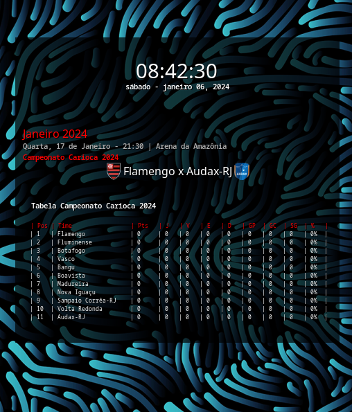

# fla-conky

O Conky é uma ferramenta de monitoramento de sistema para Linux que exibe informações como uso de CPU, memória e rede no desktop.
Sabendo que é possível personalizá-lo, adicionei algumas informações referentes ao Flamengo.

### Próximos jogos e tabela do campeonato


### fla-conky.sh
Antes de executar o script, é necessário ter um ambiente virtual do Python
```bash 
python3.11 -m venv venv && \
source venv/bin/activate && pip install -r requirements.txt && deactivate && \
chmod +x fla-conky.sh
```

```bash
./fla-conky.sh
```
